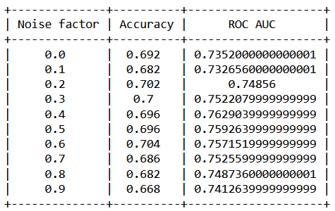

# CLIP Augmentation features

Использование модели CLIP в качестве feature extractor-a [repo](https://github.com/openai/CLIP)

При обучении классификатора к признакам добавляется случайный шум

## Сравнение результатов для различных уровней шума для модели "ViT-L/14" [ноутбук](clip_compare_augment.ipynb)

<picture></picture>
