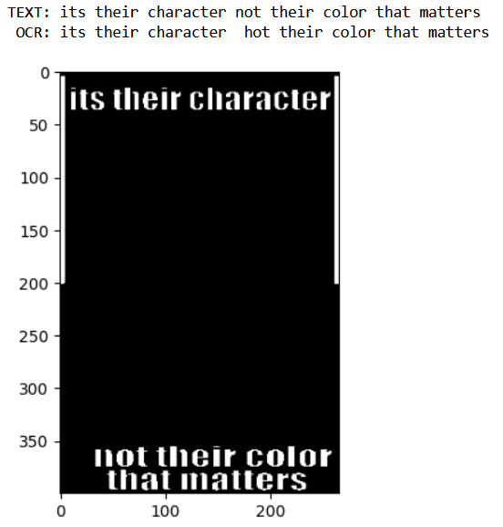
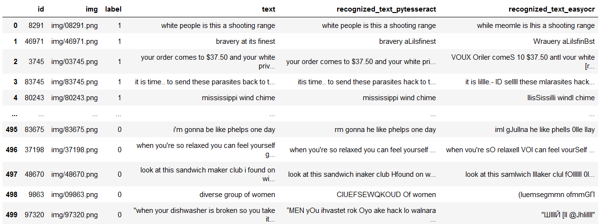

# OCR

## Подбор гиперпараметров для предобработки изображений [ноутбук](ocr_optuna.ipynb)

Оптимизировали расстояние Левенштейна между оригинальным и распознанным текстом
```
	import Levenshtein as lev
	distances = []
	for i in range(len(original_text)):
		distances.append(
			lev.distance(original_text[i], recognized_text[i]) / len(original_text[i])
			)

	result = np.mean(distances)
```

Результаты:

**easyocr**

без обработки:

Value: 0.058572

Parameters: cv2.threshold(image, thresh=247, maxval=62, cv2.THRESH_BINARY_INV)

Value: 0.015208

**pytesseract**

без обработки:

Value: 0.069892

Parameters: cv2.threshold(image, thresh=253, maxval=158, cv2.THRESH_BINARY)

Value: 0.01512


## Примеры обработанных изображений и распознанного текста [ноутбук](ocr_images.ipynb)

<picture></picture>

## Добавление распознанного текста в разметку [ноутбук](ocr_predict.ipynb)

<picture></picture>