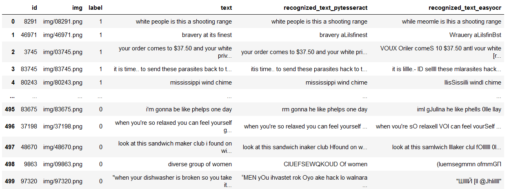

# CLIP

Использование модели CLIP в качестве feature extractor-a [repo](https://github.com/openai/CLIP)


## Сравнение различных классификаторов для модели "ViT-L/14" [ноутбук](CLIP/clip_demo.ipynb)

<picture></picture>


## Сравнение различных версий CLIP [ноутбук](CLIP/clip_compare_demo.ipynb)

<picture></picture>


# SOTA подходы

Цель - воспроизвети подходы из статьи facebook

https://ai.facebook.com/blog/hateful-memes-challenge-and-data-set/

https://arxiv.org/pdf/2005.04790v3.pdf

<picture>
  
</picture>


## 1. MMF Visual BERT COCO [Инструкция](https://github.com/facebookresearch/mmf/tree/main/projects/hateful_memes)

Модель получилось запустить только в среде google colab [описание](SOTA/mmf/visual_bert/train)


Скрипт для запуска предсказания [описание](SOTA/mmf/visual_bert/predict)

<picture>
  
</picture>

### 1.1 Использование MMF Visual BERT COCO для извлечения признаков [ноутбук](SOTA/mmf/visual_bert/feature_extractor/feature_extractor.ipynb)
 
Accuracy: 0.67	ROC AUC: 0.719472


### 1.2 Использование признаков полученных из моделей CLIP И Visual BERT [ноутбук](SOTA/mmf/visual_bert/feature_extractor/feature_extractor_mmf_clip.ipynb)
 
Accuracy: 0.698	ROC AUC: 0.7452


Качество получилось хуже чем при использовании только CLIP (Accuracy: 0.732 ROC AUC: 0.798672) (ViT-L/14)


# OCR

## Подбор гиперпараметров для предобработки изображений [ноутбук](OCR/ocr_optuna.ipynb)

Оптимизировали расстояние Левенштейна между оригинальным и распознанным текстом
```
	import Levenshtein as lev
	distances = []
	for i in range(len(original_text)):
		distances.append(
			lev.distance(original_text[i], recognized_text[i]) / len(original_text[i])
			)

	result = np.mean(distances)
```

Результаты:

**easyocr**

без обработки:

Value: 0.058572

Parameters: cv2.threshold(image, thresh=253, maxval=95, cv2.THRESH_BINARY_INV)

Value: 0.040528

**pytesseract**

без обработки:

Value: 0.069892

Parameters: cv2.threshold(image, thresh=253, maxval=158, cv2.THRESH_BINARY)

Value: 0.01512


## Примеры обработанных изображений и распознанного текста [ноутбук](OCR/ocr_images.ipynb)

<picture></picture>

## Добавление распознанного текста в разметку [ноутбук](OCR/ocr_predict.ipynb)

<picture></picture>


# Использование признаков только из картинок, без текста и с текстом через OCR

### Только картинки, без надпиcей и без текста [ноутбук](CLIP+OCR/clip_image_no_caption.ipynb)

Accuracy: 0.582	ROC AUC: 0.618944

### Используем картинки с надписями без текста [ноутбук](CLIP+OCR/clip_image_with_caption.ipynb)

Accuracy: 0.7	ROC AUC: 0.776048

### Картинки без надпией + текст из разметки [ноутбук](CLIP+OCR/clip_image_no_caption_text.ipynb)

Accuracy: 0.684	ROC AUC: 0.748976

### Картинки без надпией + текст который распознали с помощью easyocr [ноутбук](CLIP+OCR/clip_image_no_caption_text_ocr_easyocr.ipynb)

(Сократил длину строки до 50 вместо 77)

Accuracy: 0.584	ROC AUC: 0.59608

### Картинки без надпией + текст который распознали с помощью pytesseract [ноутбук](CLIP+OCR/clip_image_no_caption_text_ocr_pytesseract.ipynb)

Accuracy: 0.652	ROC AUC: 0.69752


# CLIP Augmentation features

При обучении классификатора к признакам добавляется случайный шум

## Сравнение результатов для различных уровней шума для модели "ViT-L/14" [ноутбук](CLIP_augment/clip_compare_augment.ipynb)

<picture></picture>
