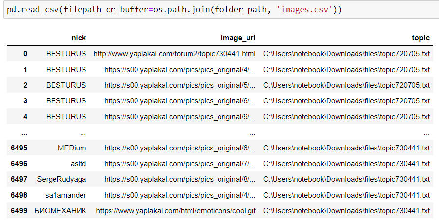

# Сохранение картинок

## Инструкция

1. [Устанавливаем расширение для браузера](chrome://extensions/)


1. Находим интересный пост и нажимаем кнопку *start*


1. Сохраняем текстовый файл

1. Переходим к следующему посту и повторяем сколько потребуется

1. Запускаем скрипт create-dataframe.py, передаем в качестве параметра путь к сохраненным файлам
   ```
   python create-dataframe.py /files
   ```
   
1. В результате получается .scv файл


